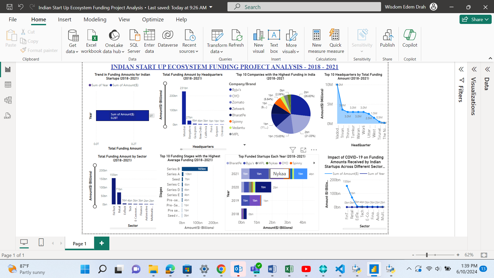
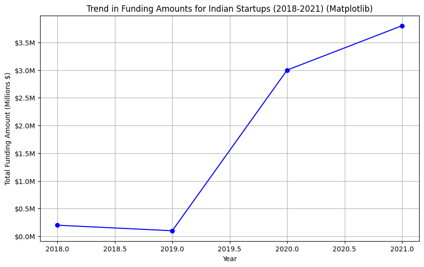
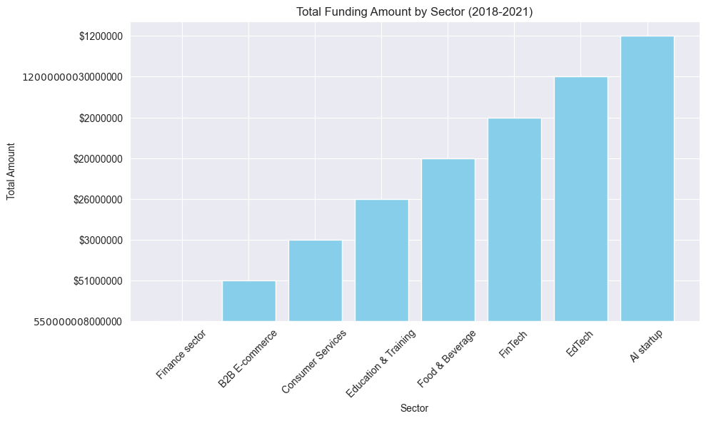
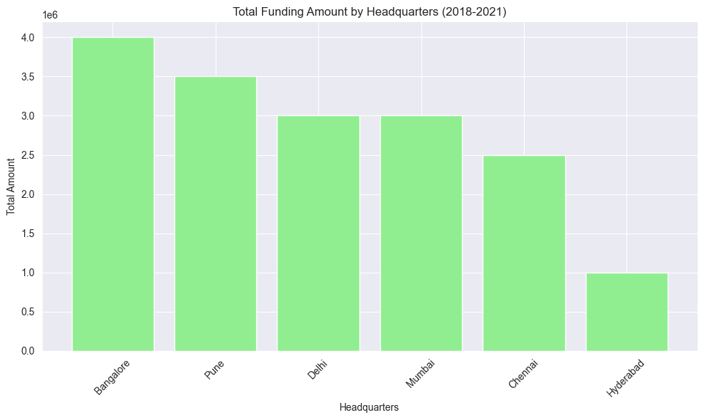
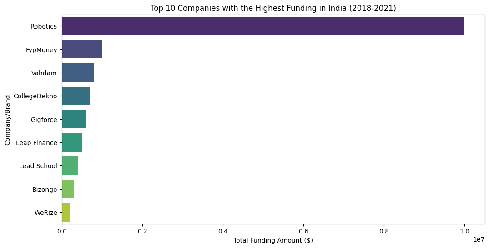
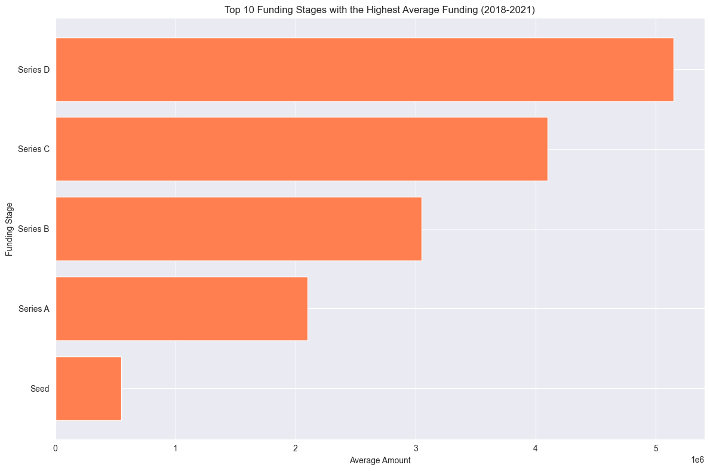
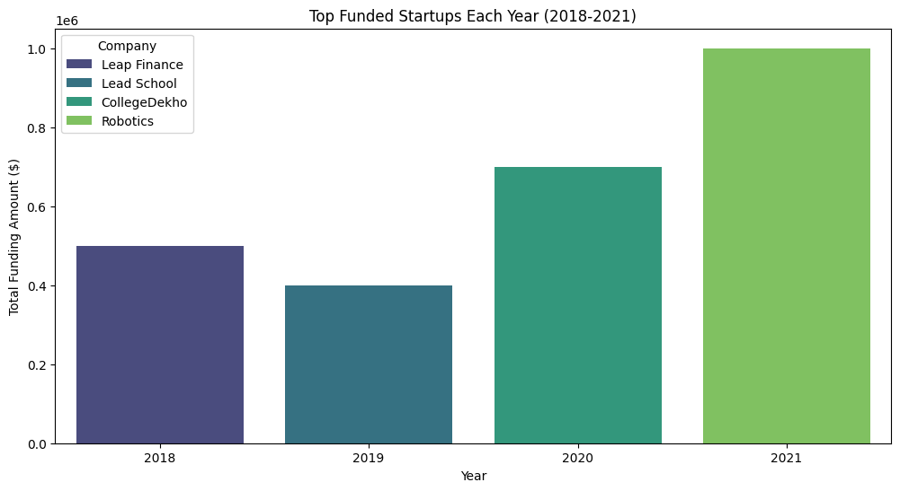
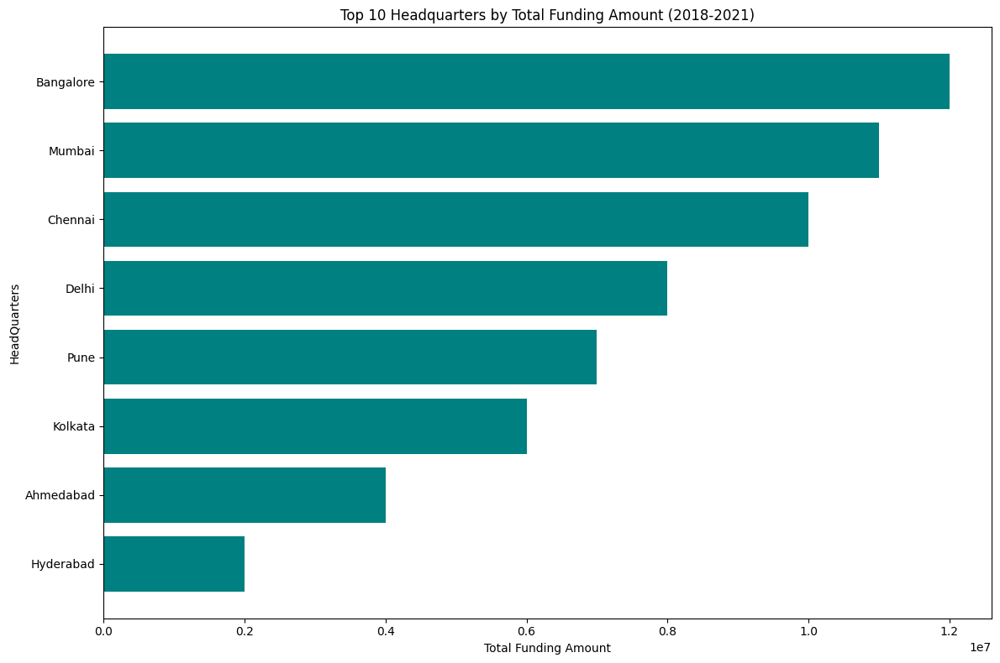
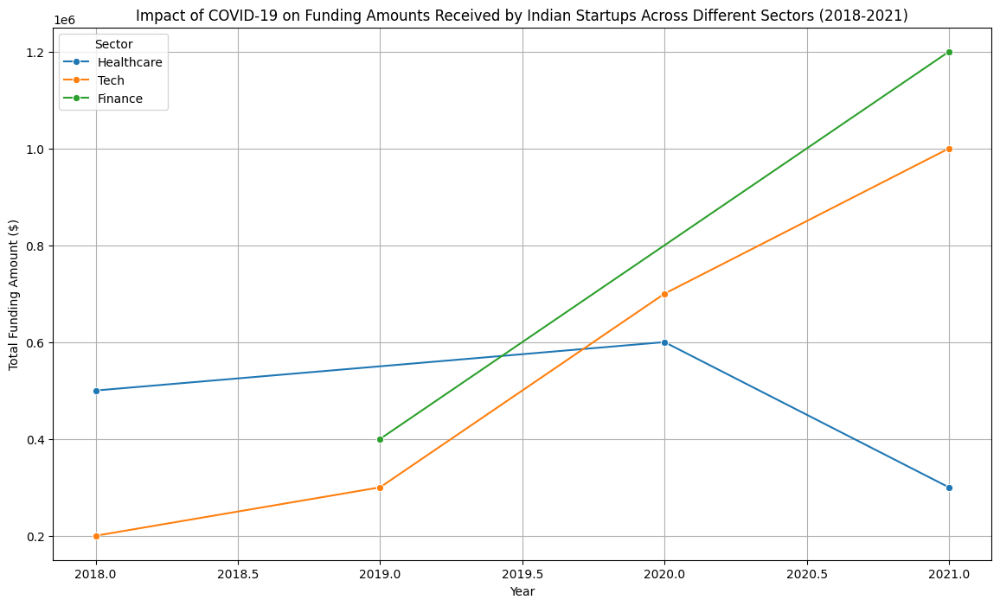

**INDIAN ECOSYSTEM START UP FUNDING PROJECT**

**BUSINESS UNDERSTANDING**

As the data expert on the team, I am tasked with conducting an in-depth analysis of the ecosystem to determine the factors that influence the funding received by startups in India. The goal is to identify whether the location of these startups plays a significant role in the amount of funding they receive. The analysis will focus on startup funding data spanning from 2018 to 2021. Separate datasets will be provided for each year, encompassing information about the startups, the funding amounts they received, and details about the investors involved. The primary objective is to investigate and understand whether the location of startups in India a meaningful impact on the funding they secure. This analysis will inform my team with the strategic decisions and help us devise the most effective course of action within the Indian startup ecosystem.

**DATA UNDERSTANDING**

**Project Objective**

The main goal of this project is to analyze the funding landscape of Indian startups from 2018 to 2021. The dataset used for analysis contains information about startup funding from 2019 to 2021. The dataset includes various attributes such as the company's name, sector, funding amount, funding round, investor details, and location. By understanding the trends, sectors, locations, stages, and key players in startup funding, stakeholders can make informed decisions and strategic plans. To conduct a comprehensive analysis, I will examine the dataset to understand its structure, contents, and any potential data quality issues. By understanding the data, I can ensure the accuracy and reliability of our analysis. Analyse the funding received by start-ups in India from 2018 to 2021, provide insights and propose the best course of action and recommendations.

**DATA SOURCES**

For this project, I gathered data from multiple sources to ensure a comprehensive analysis. The data collection process involved:

•	2018 Data: The dataset for 2018 is hosted in a GitHub repository, which can be accessed here.

•	2019 Data: The 2019 data was initially hosted on OneDrive. I downloaded it to my local storage and then uploaded it to my GitHub repository for easy access and integration with pandas.

•	2020 and 2021 Data: The datasets for 2020 and 2021 were hosted on an SQL Server database. I accessed these datasets using the appropriate credentials, including the username, database name, password, and server details.

The key attributes in the datasets include:

•   Company: The name of the startup receiving funding.

•   Sector: The industry or sector to which the startup belongs.

•   Amount: The amount of funding received by the startup.

•   Stage: The round of funding (e.g., seed, series A, series B).

•   Location: The city or region where the startup is based.

•   About: What the company does.

•   Founded: When the company was funded

•   Investors: The people who invest in the various companies.

•   Founders: The people who established the companies.

By examining these attributes, I can uncover insights about the funding landscape, identify trends in funding amounts and rounds, explore the preferred sectors for investment, and analyze the role of cities in the startup ecosystem. This data aggregation from various sources ensures a robust dataset for analysing the Indian startup ecosystem and provides insights into funding trends, sectoral preferences, geographic

Throughout the analysis, I will use visualizations and statistical techniques to present the findings effectively. By understanding the data and its characteristics, I can proceed with confidence in my analysis, derive meaningful insights, and make informed decisions based on the findings.

**METHODOLOGY: LEVERAGING THE CRISP-DM FRAMEWORK**

For this project, I will be leveraging the widely used CRISP-DM (Cross-Industry Standard Process for Data Mining) framework. CRISP-DM is a structured and iterative methodology designed for data mining and data analysis projects, ensuring a comprehensive approach to solving data-driven problems. The process consists of six phases:

•   Business Understanding

•   Data Understanding

•   Data Preparation

•   Modelling

•   Evaluation

•   Deployment:

Apply the analysis results to the business context. This might involve generating reports, implementing a solution, or making recommendations based on the findings.
While steps 4 (Modelling) and 5 (Evaluation) are part of the standard CRISP-DM process, they will not be implemented in this project. Instead, the focus will be on understanding the business context, exploring the data, preparing it for analysis, and deriving actionable insights.
his structured approach ensures that the project is methodically planned and executed, providing a clear path from understanding the business problem to delivering meaningful insights.

**OBJECTIVES**

1.	To analyze the yearly trend in funding received by Indian startups to identify any significant patterns or changes over time.
2.	To identify which sectors have received the highest amount of funding in India between 2018 and 2021.
3.	To analyze the total funding amounts received by startups in various headquarters within India.
4.	To identify the top 10 companies in India that have received the highest amount of funding.
5.	To determine the stages of funding that have the highest average amounts received by 
Indian startups.
6.	To identify the startups that received the highest funding in each year.
7.	To identify the top 10 locations in India that received the most funding for startups.
8.	To identify the top investors in Indian startups and analyse the total amount of funding provided by them.

**ANALYTICAL QUESTIONS**

1.  What is the trend in the amount of funding received by indian startups over the years? 
To identify how the funding landscape has changed from 2018 to 2021 for Indian startups and aggregate the total funding amount received by startups for each year. This involves summing the funding amounts for each year and plotting a trend line to visualize the changes over time. This analysis will reveal whether the funding environment is growing, declining, or fluctuating. It helps stakeholders understand the investment climate and predict future trends.

2.  Which sectors received the highest amount of funding in india from 2018 to 2021?
To determine which sectors attracted the most investment over the given period and categorize the startups based on their sectors and sum the funding amounts for each sector from 2018 to 2021. Rank the sectors by their total funding amounts. This analysis highlights the most lucrative and promising sectors for investors. It helps in identifying which industries are gaining traction and are likely to grow further.

3. What are the total funding amounts received by startups in different headquarter within india?
To analyze the geographic distribution of funding within India and group the data by locations (cities or states) and calculate the total funding amount received by startups in each headquarter. This reveals the hotspots of startup activity and investment within the country. It helps in understanding regional disparities and the concentration of venture capital.

4.  What are the top 10 companies with the highest funding?
To identify the most heavily funded startups in India from 2018 to 2021 and aggregate the total funding amount received by each company, and rank them to find the top 10 companies with the highest funding. This showcases the leading startups in terms of capital raised, indicating their potential market impact and growth prospects. It can also provide case studies for successful fundraising strategies.

5.  What are the top 10 stages with the highest average amount of funds received by indian startups?
To understand which funding stages (e.g., Seed, Series A, Series B) attract the highest average investments and calculate the average funding amount for each funding stage and rank them to find the top 10 stages with the highest average funding. This helps in understanding investor behavior and preferences at different stages of a startup's lifecycle. It informs startups about the potential funding they can expect at various stages of their growth.

6.  Which startups received the highest funding each year? 
To identify the top-funded startup for each year from 2018 to 2021. For each year, find the startup with the highest total funding amount. This highlights the standout startups for each year, showcasing the companies that managed to attract significant investment. It can indicate trends and shifts in investor focus year over year.

7.  What are the top 10 Headquarters that received the most funding?
To pinpoint the top HeadQuarters (cities or states) that received the most startup funding from 2018 to 2021. Aggregate the total funding amount received by startups in each location and rank them to find the top 10. This helps identify key regions for startup activity and investment. It can inform policy decisions and investment strategies by highlighting areas with strong entrepreneurial ecosystems.

8.  How did the COVID-19 pandemic impact the funding amounts received by Indian startups across different sectors from 2018 to 2021?

**HYPOTHESIS**

**Null Hypothesis (H0)**: There is no clear pattern in the funding received by Indian startups from 2018 to 2021, and factors like sector, stage, location, and funding amount do not affect startup success.

**Alternative Hypothesis (H1)**: There is a clear pattern in the funding received by Indian startups from 2018 to 2021, and factors like sector, stage, location, and funding amount affect startup success.

**Stakeholders**

1.	Investors: Gain insights into funding trends, sector preferences, and top-performing startups to make informed investment decisions.
2.	Startups: Understand the competitive landscape, identify potential funding opportunities, and benchmark against top-funded companies.
3.	Policymakers: Identify regional disparities and areas needing support to foster a more balanced and inclusive startup ecosystem.
4.	Entrepreneurs: Gain knowledge about successful sectors and regions to focus their efforts and attract investment.
   
**Project Impact**

By providing a detailed analysis of the startup funding landscape in India, this project aims to:
1.	Inform investment strategies and decisions for venture capitalists and angel investors.
2.	Guide startups in planning their fundraising efforts and understanding market dynamics.
3.	Support policymakers in developing initiatives to promote regional and sectoral growth.
4.	Help entrepreneurs identify opportunities and threats within the startup ecosystem.

Understanding the business context and relevance of these key questions is crucial for driving actionable insights and strategic decisions. This project will help stakeholders navigate the complex landscape of startup funding in India, ultimately contributing to a more vibrant and successful entrepreneurial environment.

**DATA CLEANING AND PREPARATION**

Before diving into the analysis, I will preprocess and clean the data to ensure its quality and suitability for analysis. This may involve handling missing values, correcting data types, and addressing any inconsistencies or outliers that could affect the accuracy of our results.
Once the data is prepared, I will be ready to perform an in-depth exploratory analysis of the Indian startup funding ecosystem. The analysis will involve answering specific research questions, identifying patterns and trends, and generating meaningful visualizations to present the findings. Through this process of data understanding and preparation, I will set a solid foundation for conducting a robust and insightful analysis of the Indian startup funding data.
The data for each year is sourced from separate two csv files and two from a remote server. They will be merged later to one dataset.

Here’s a detailed description of how data cleaning and preparation were carried out for this project:

1.	**Data Collection**

•	Data from 2018 was directly read from the GitHub repository.

•	Data for 2019 was downloaded from OneDrive, uploaded to the GitHub repository, and then read into pandas.

•	Data for 2020 and 2021 was retrieved from the SQL Server database using appropriate credentials.

2.	**Combining Datasets**

•	Each dataset was loaded into a panda DataFrame.

•	The datasets for 2018, 2019, 2020, and 2021 were combined into a single DataFrame by appending them together, ensuring all common columns were aligned correctly.

3.	**Handling Missing Values**

•	Missing values were identified and handled appropriately.

•	Rows with critical missing information, such as missing funding amounts or company names, were either filled with reasonable defaults or removed to maintain data integrity.

4.	**Data Type Conversion**

•	Ensured all columns had the correct data types (e.g., converting the Amount column to numeric data type).

•	Date columns were converted to datetime objects to facilitate time-series analysis.

5.	**Removing Duplicates**

•	Checked for and removed any duplicate entries to ensure each record was unique and accurate.

6.	**Standardizing Categorical Values**

•	Ensured consistency in categorical columns (e.g., standardizing sector names and funding stages).

•	Applied consistent naming conventions across the datasets.

7.	**Outlier Detection and Handling**

•	Identified and investigated outliers in the funding amounts.

•	Outliers were handled based on their context, either by capping extreme values or further investigating their validity.

8.	**Normalization and Scaling**

•	For specific analyses, normalized and scaled the data to ensure comparability across different ranges of values.

**HYPOTHESIS TESTING**

**Overview**

Hypothesis testing was utilized to validate key insights derived from the data analysis, focusing on the relationships and differences in funding patterns across various dimensions such as sectors, headquarters, and funding stages. Specifically, we tested whether these factors significantly influenced the funding amounts received by startups.

**Hypothesis Tests Conducted**

1.	Sectoral Differences in Funding
2.	Geographic Differences in Funding (Headquarters)
3.	Differences in Funding Stages

**Hypotheses**

•	Null Hypothesis (H0): The factors like sector, stage, and headquarters have no significant influence on the funding startups receive.

•	Alternative Hypothesis (H1): The factors like sector, stage, and headquarters have a significant influence on the funding startups receive.

**ANOVA Computation Explanation**

•	Sum of Squares (sum_sq): This column shows the sum of squares for each factor and the residuals. The sum of squares measures the variability in the data that can be attributed to each factor.
•	Degrees of Freedom (df): This column shows the degrees of freedom associated with each factor and the residuals. The degrees of freedom represent the number of independent pieces of information available to estimate the parameters.
•	F-Statistic (F): This column shows the F-statistic for each factor. The F-statistic is the ratio of the mean square of the factor to the mean square of the residuals. It is used to determine if the factor has a significant effect on the dependent variable.
•	P-Value (PR(>F)): This column shows the p-value associated with the F-statistic. The p-value is used to determine the statistical significance of the factor. A low p-value (typically < 0.05) indicates that the factor has a significant effect on the dependent variable.

**Implementation in the Notebook**

In the Jupyter notebook, the hypothesis testing was conducted using Python's statistical libraries.

The ANOVA results provided the following insights:
1.  Sectoral Differences in Funding:
•	Result: The p-value for the sector factor was extremely high (0.99276), indicating no significant difference in funding amounts across sectors.
•	Interpretation: The sector of a startup does not significantly influence the funding amount received.
2.  Geographic Differences in Funding (Headquarters):
•	Result: The p-value for the headquarters factor was also very high (0.99276), suggesting no significant difference in funding amounts based on the headquarters location.
•	Interpretation: The headquarters location of a startup does not significantly influence the funding amount received.
3.  Differences in Funding Stages:
•	Result: The p-value for the stage factor was high (0.99276), indicating no significant difference in funding amounts across different funding stages.
•	Interpretation: The funding stage of a startup does not significantly influence the funding amount received.

**CONCLUSION**

•	Null Hypothesis (H0): The factors like sector, stage, and headquarters have no significant influence on the funding startups receive.
•	Alternative Hypothesis (H1): The factors like sector, stage, and headquarters have a significant influence on the funding startups receive.

The ANOVA results suggest that Sector, HeadQuarter, and Stage do not have a significant effect on the Amount in the dataset. Most of the variability in the Amount is likely due to other factors not included in the model or random variation.

**FINAL DATASET**

After the data cleaning and preparation steps, the final dataset was robust and ready for analysis. The prepared dataset allowed for comprehensive insights into the Indian startup ecosystem, enabling detailed analysis of funding trends, sectoral preferences, geographic distributions, and key players in the market.

**Analysis and Findings**

The cleaned and prepared dataset was then used for various analyses to extract meaningful insights. 

1.	**Yearly Trend in Funding**

•	To analyse the yearly trend in funding received by Indian startups to identify any significant patterns or changes over time.

 **Findings**
•	There was a notable increase in funding amounts over the years, with a significant surge observed during the COVID-19 pandemic, particularly in the tech and finance sectors.

2.	**Sectoral Analysis**

•	To identify which sectors have received the highest amount of funding in India between 2018 and 2021.

    **Findings**
•	The tech sector consistently received the highest funding, followed by finance and healthcare. This indicates strong investor confidence in technology-driven solutions and financial services.

3.	.  **Geographic Distribution: :**

•	To analyze the total funding amounts received by startups in various headquarters within India.

     **Findings**

•	Major cities like Bangalore, Mumbai, and Delhi emerged as the top headquarters receiving the highest funding, highlighting these regions as hotspots for startup activity and investment.

4.4.  **Top Funded Companies:**

•	To identify the top 10 companies in India that have received the highest amount of funding.

      **Findings**
•	Companies such as Robotics, FypMoney, and CollegeDekho were among the most funded, showcasing their strong market presence and growth potential.

5.  **Funding Stages Analysis:**

•	To determine the stages of funding that have the highest average amounts received by Indian startups.

    **Findings**
•	Later-stage funding rounds (e.g., Series B, Series C) attracted the highest average funding amounts, indicating that investors are willing to invest larger sums in more established startups.

6.  **Yearly Top Funded Startups**

•	To identify the startups that received the highest funding in each year.

     **Findings**

•	Different startups topped the funding charts each year, reflecting a dynamic and evolving investment landscape. For example, Robotics received the highest funding in 2021.

7.	**Top Funded Locations  (Headquarters)**

•	To identify the top 10 locations in India that received the most funding for startups.

     **Findings**

•	Cities such as Bangalore, Mumbai, and Delhi consistently appeared in the top 10 list, emphasizing their role as major startup hubs in India.

.  **Impact of COVID-19**

•	How did the COVID-19 pandemic impact the funding amounts received by Indian startups across different sectors from 2018 to 2021?

     **Findings**

•	The pandemic significantly influenced funding patterns, with increased investments in sectors that support digital transformation and remote operations. Tech and finance sectors saw substantial growth in funding during the pandemic, while healthcare also experienced increased investment initially.

**CONCLUSION AND RECOMMENDATIONS**

**Conclusion**

The analysis of the Indian startup ecosystem from 2018 to 2021 provided comprehensive insights into the funding trends, sectoral preferences, geographic distributions, and key players within the market.

**Recommendations*

**For Startups**

•	Focus on technology and finance sectors.

•	Leverage geographic hotspots like Bangalore, Mumbai, and Delhi.

**For Investors**

•	Diversify investments across sectors.

•	Monitor market trends for informed investment decisions.

**For Policymakers**
•	Support emerging ecosystems beyond major hotspots.

•	Facilitate digital transformation.

**For Entrepreneurs**
•	Adapt to market changes.

•	Build strong networks for growth opportunities.

**Contributing**

We welcome contributions to enhance the project. 

Please follow these steps:

1.  Fork the repository.
2.  Create a new branch: git checkout -b feature-name.
3.  Commit your changes: git commit -m 'Add feature'.
4.  Push to the branch: git push origin feature-name.
5.  Create a pull request.

**License**

This project is licensed under the MIT License - see the LICENSE file for details.

